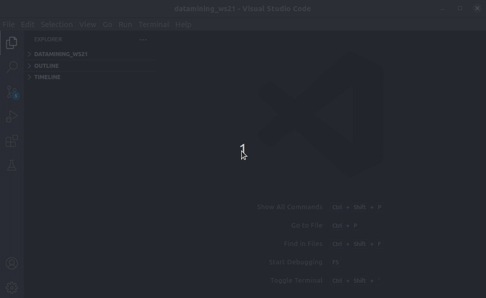
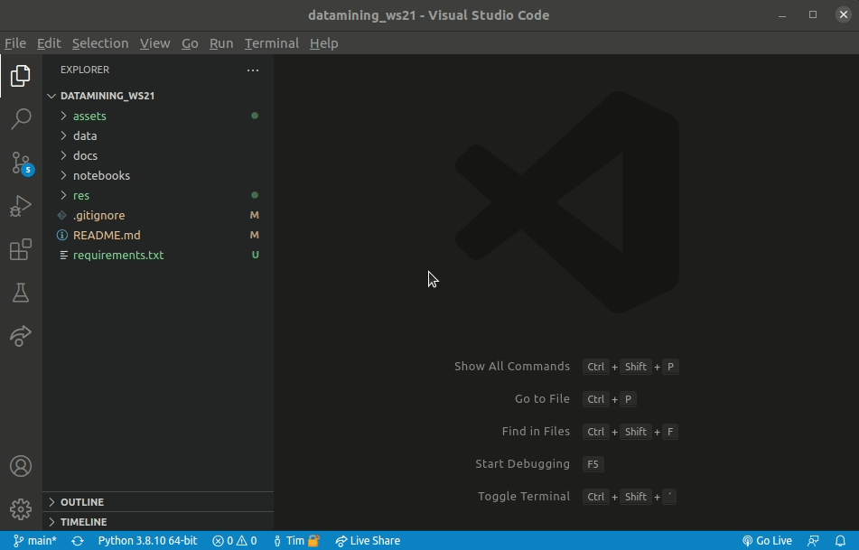
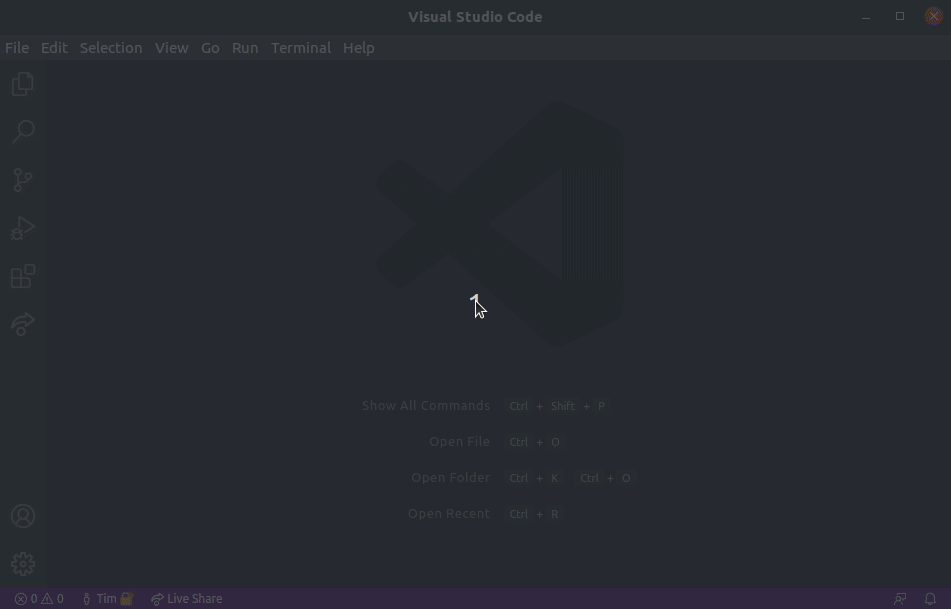

# Data Mining Pair-Programming Wintersemester 2021
Dieses Repository stellt Jupyter Notebooks bereit, in welchen die Lehrinhalte der [Vorlesung "Data Mining" der Universität Leipzig im Wintersemester 2021 / 2022](https://dbs.uni-leipzig.de/de/stud/2021ws/dm) implementiert und an Beispielen erläutert werden.

Die Jupyter-Notebooks werden von Studierenden im Rahmen von Pair-Programming-Sessions umgesetzt.

Dieses Repository wird nach Fertigstellung ebenfalls auf dem [Git des Fachschaftsrat Informatik (FSR)](https://git.fsinf.informatik.uni-leipzig.de/) bereitgestellt. 

## Lehrinhalte der Vorlesung "Data Mining"
Als Grundlage für die Vorlesung dient das Buch ["Mining of Massive Datasets"](http://www.mmds.org/) von Leskovec J., A. Rajaraman, J. Ullman.

Auf der verlinkten Webseite stehen das Buch, Original-Folien sowie Aufzeichnungen der Vorlesung an der Stanford-Universität zum Download bereit. 

Da jedes Buchkapitel einzeln heruntergeladen werden muss, befindet sich im res-Unterverzeichnis dieses Repositories ein bash-Skript, welches jedes Kapitel automatisiert herunterlädt.
`bash res/fetch_book_mmds.sh`

#### Kapitel / Lehrinhalte der Vorlesung:
Kapitel | Mögliche Themen für ein Jupyter Notebook
--- | ---
Clustering | - Hierarchische Clusteranalyse - k-Means-Algorithmus - BFR-Algorithmus - CURE-Algorithmus - Implementierung und Vergleich weiterer Algorithmen (z.B. von [hier](https://scikit-learn.org/stable/modules/clustering.html))
Dimensionsreduktion | - Hauptkomponentenanalyse (PCA) - Singulärwertzerlegung (SVD) - CUR-Zerlegung - Implementierung weiterer State-of-the-Art-Algorithmen (z.B. [t-SNE](https://en.wikipedia.org/wiki/T-distributed_stochastic_neighbor_embedding))
Empfehlungssysteme | tbd
Assoziationsregeln | tbd
Locality Sensitive Hashing | tbd
Supervised ML | tbd
Community Detection | tbd
PageRank | tbd
Web Spam | tbd
Windowing | tbd
Filtern | tbd
Momente | tbd
Web Advertising | tbd

## Verwendung der bestehenden Jupyter-Notebooks
Die bestehenden Jupyter-Notebooks im Unterverzeichnis notebooks können entweder am eigenen Rechner oder im Browser über Binder verwendet werden.

#### Jupyter-Notebooks auf dem eigenen Rechner verwenden
Hierfür muss eine Python-Umgebung installiert sein. Sollte keine installiert sein, empfiehlt es sich, [Anaconda](https://docs.anaconda.com/anaconda/install/index.html) aufzusetzen.

1. Repository clonen.
`git clone https://github.com/startbit96/datamining_ws21.git`
(oder über den Download-Button herunterladen)

2. Benötigte Python-Bibliotheken installieren.
`cd datamining_ws21`
`pip install -r requirements.txt`

3. Jupyter-Notebook starten.
`jupyter notebook`

Nun öffnet sich ein Browser-Fenster, in welchem die Notebooks geöffnet und bearbeitet werden können.
Änderungen bleiben lokal erhalten.

#### Jupyter-Notebooks über Binder verwenden
[Binder](https://mybinder.org/) ermöglicht das Hosten von Jupyter Notebooks im Internet ohne Installation auf dem eigenen Rechner. 

Dies hat den Vorteil, dass die Notebooks direkt verwendet werden können. Jedoch werden eigene Änderungen an den Notebooks nicht abgespeichert und gehen nach Beenden der Session verloren.

Um die Notebooks über den Binder-Service zu verwenden, ist folgende URL aufzurufen:
https://mybinder.org/v2/gh/startbit96/datamining_ws21/HEAD

## Pair-Programming-Sessions
Die Pair-Programming-Sessions dienen dazu, die Jupyter Notebooks mit Inhalten zu befüllen.

#### Vorbereitung

Vorbereitend bitte eine Python-Umgebung (z.B. [Anaconda](https://docs.anaconda.com/anaconda/install/index.html)) sowie [Visual Studio Code](https://code.visualstudio.com/) installieren. 
Visual Studio Code ist für Linux auch als [Snap](https://snapcraft.io/code) verfügbar.
Innerhalb von Visual Studio Code ist es möglich, Erweiterungen / Extensions zu installieren. Folgende Extensions werden benötigt:
- Extension "Live Share" 
(wird für Pair-Programming benötigt, nach Installation der Extension mit GitHub-Account anmelden, weitere Infos findet ihr [hier](https://visualstudio.microsoft.com/services/live-share/))
- Extension "Python"
- Extension "Jupyter"

Bitte teilt mir euren GitHub-Usernamen mit, damit ich euch als Collaborator zu dem Repository hinzufügen kann.

#### Ablauf der Pair-Programming-Sessions
Wir treffen uns dazu per Voice- und/oder Video-Chat im Discord-Channel (wird über Chatgruppe verteilt).
Nach Einteilung der Gruppen und Zuteilung der Themen, bitte wie folgt vorgehen:

Es wird ein Gruppenmitglied bestimmt (folgend "Host" genannt), welches seine **lokalen** Projekt-Dateien während der Pair-Programming-Session über die Visual Studio Code Live-Share-Extension teilen wird (vorzugsweise das Mitglied mit der meisten Git-Erfahrung und stabilsten Internetverbindung).

Alle anderen Mitglieder der Gruppe (folgend "Gäste" genannt) werden über die Visual Studio Codes Live-Share-Extension an seinen lokalen Dateien mitarbeiten können, brauchen demnach die Dateien also nicht selber herunterladen. 
**Hinweis:** Sowohl Host als auch Gäste benötigen Visual Studio Code und die Live-Share-Extension.

1. Host: Repository clonen und in das Projektverzeichnis wechseln.  
`git clone https://github.com/startbit96/datamining_ws21.git`  
`cd datamining_ws21`
2. Host: Main-Branch des Repositories auf den aktuellsten Stand bringen. 
(nur notwendig, wenn Repository bereits vor einer Weile geclont wurde und herumgespielt wurde)  
`git checkout main`  
`git fetch origin`  
`git reset --hard origin/main`
3. Host: Neuen Branch erstellen, um das Repository um ein Notebook zu erweitern.  
In den Namen des Branches bitte auch das Thema mit aufnehmen.  
`git checkout -b '<branch-name>'`
4. Host: Vorlagen-Notebook in den Notebook-Ordner kopieren und je nach Thema umbenennen.  
`cp notebooks/template.ipynb notebooks/<notebook-name>.ipynb`
5. Host: Projektordner in Visual Studio Code öffnen. Dazu entweder Visual Studio Code öffnen und "Datei > Ordner öffnen" anwählen oder über das Terminal öffnen (vorher in den Projekt-Ordner navigieren).  
`code .`
5. Host: Live-Share-Session starten und Link an die anderen Gruppenmitglieder verteilen.  
  
6. Gäste: Live-Share-Session des Hosts beitreten (ggf. noch vom Host zu bestätigen).  
  
7. Alle: Notebook gemeinschaftlich befüllen (Vorlagen-Notebook kann als Anhaltspunkt für die inhaltliche Struktur genutzt werden).
9. Host: Änderungen commiten (ggf. weitere Dateien bei `git add ...` hinzufügen).  
`git add <notebook-name>.ipynb`  
`git commit -m "<Commit beschreiben (was wurde geändert?)>"`
10. Host: Notebook am Ende der Pair-Programming-Session pushen.  
`git push -u origin <branch-name>`

**Hinweis:** Euer Notebook ist nun nur in eurem erstellten Branch. Ihr müsst das Mergen nicht selber übernehmen. Am Ende der Pair-Programming-Sessions wird das Mergen der einzelnen Branches in den main-Branch zentral vom Admin durchgeführt.
  
  

#### Spielerunde zum Ausklingen :video_game: 
Ideen für Spiele für eine anschließende Spielrunde:
- [Skribbl](https://skribbl.io/) (Zeichnen und Raten)
- [Gartic Phone](https://garticphone.com/) (Mischung aus Skribbl und stille Post)
- [Geotastic](https://geotastic.de/home) (Geografie-Quiz im Street-View-Modus)
- [AmongUs](https://store.steampowered.com/app/945360/Among_Us/) (ähnlich zu Werwolf, auch kostenlos übers Handy spielbar)
- [Boardgame Arena](https://en.boardgamearena.com/)
- ...